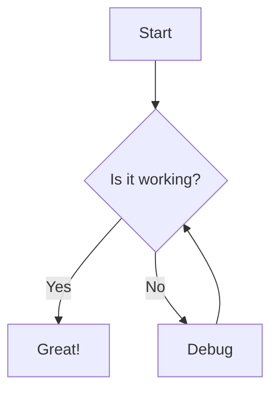
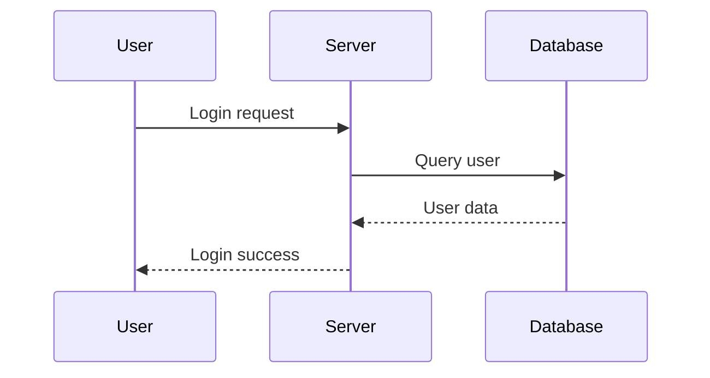
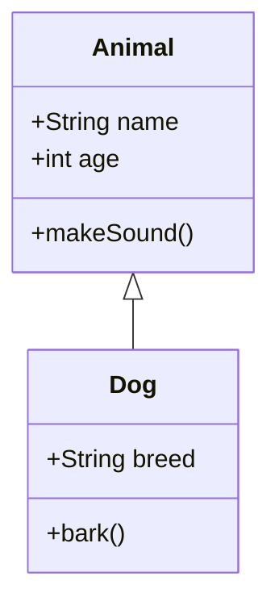
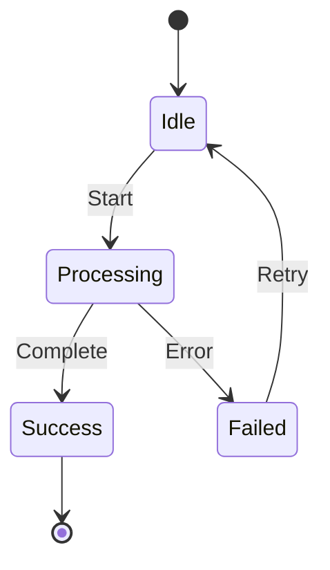
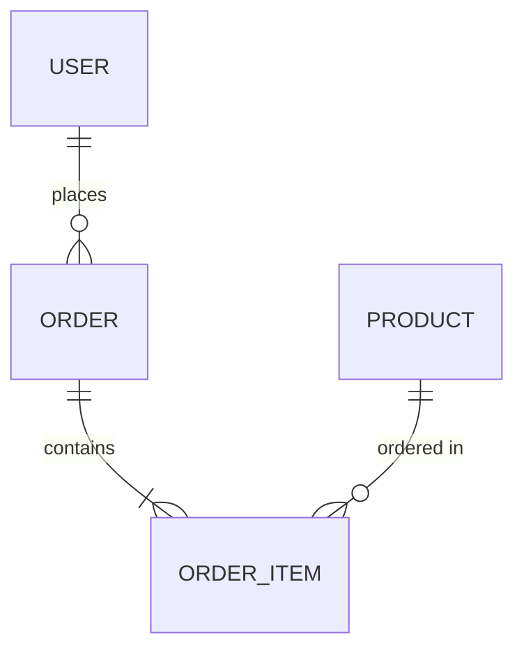

# Mermaid Diagram Generator for OpenCode

A custom tool for OpenCode that generates diagram images from Mermaid text notation.

## Prerequisites

You need to install `mermaid-cli` (mmdc) to use this tool:

```bash
npm install -g @mermaid-js/mermaid-cli
```

Or using other package managers:
```bash
# Using yarn
yarn global add @mermaid-js/mermaid-cli

# Using pnpm
pnpm add -g @mermaid-js/mermaid-cli
```

## Installation

The tool files are already installed in `~/.config/opencode/tool/`:
- `mermaid.ts` - Tool definition for OpenCode
- `generate_mermaid.py` - Python script that generates diagrams
- `MERMAID_README.md` - This file

## Usage

In OpenCode, you can now use the `mermaid` tool to generate diagrams. The LLM can call this tool automatically, or you can reference it in your prompts.

### Example Prompts

1. **Simple flowchart:**
   ```
   Generate a flowchart showing the login process
   ```

2. **Sequence diagram:**
   ```
   Create a sequence diagram for user authentication with OAuth
   ```

3. **With custom options:**
   ```
   Generate a dark-themed ER diagram for a blog database with transparent background
   ```

### Tool Parameters

- `mermaid_text` (required): Mermaid diagram notation
- `output_path` (optional): Custom output path (default: ~/Downloads/mermaid_diagram.png)
- `format` (optional): Output format - png, svg, or pdf (default: png)
- `theme` (optional): Visual theme - default, forest, dark, or neutral (default: default)
- `background` (optional): Background color (default: white, can use 'transparent' or any CSS color)

### Mermaid Syntax Examples

**Flowchart:**


**Sequence Diagram:**


**Class Diagram:**


**State Diagram:**


**ER Diagram:**


## How It Works

1. OpenCode's LLM can call the `mermaid` tool when needed
2. The tool passes the Mermaid text to the Python script
3. The Python script uses `mmdc` (mermaid-cli) to generate the diagram
4. The generated image is saved to the specified location (default: ~/Downloads/)
5. OpenCode returns the path to the generated file

## Troubleshooting

### "mermaid-cli (mmdc) is not installed"
Install mermaid-cli globally:
```bash
npm install -g @mermaid-js/mermaid-cli
```

### Permission denied errors
Make sure the Python script is executable:
```bash
chmod +x ~/.config/opencode/tool/generate_mermaid.py
```

### Python not found
Make sure Python 3 is installed and available in your PATH:
```bash
python3 --version
```

## Additional Resources

- [Mermaid Documentation](https://mermaid.js.org/)
- [Mermaid Live Editor](https://mermaid.live/) - Test your diagrams online
- [OpenCode Custom Tools Documentation](https://opencode.ai/docs/custom-tools/)
